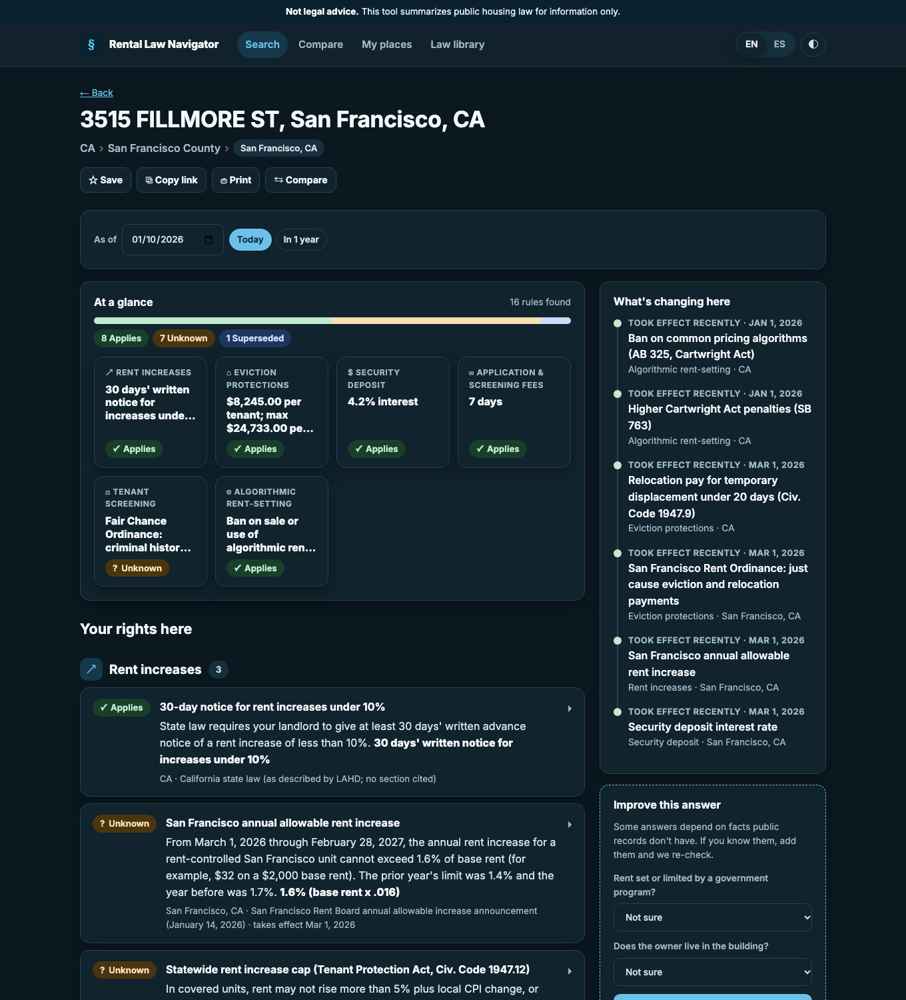
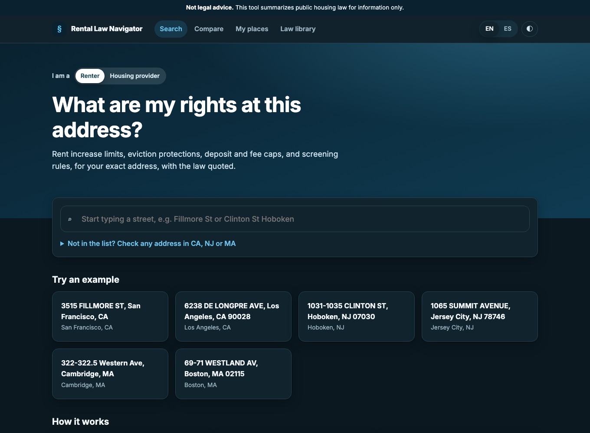
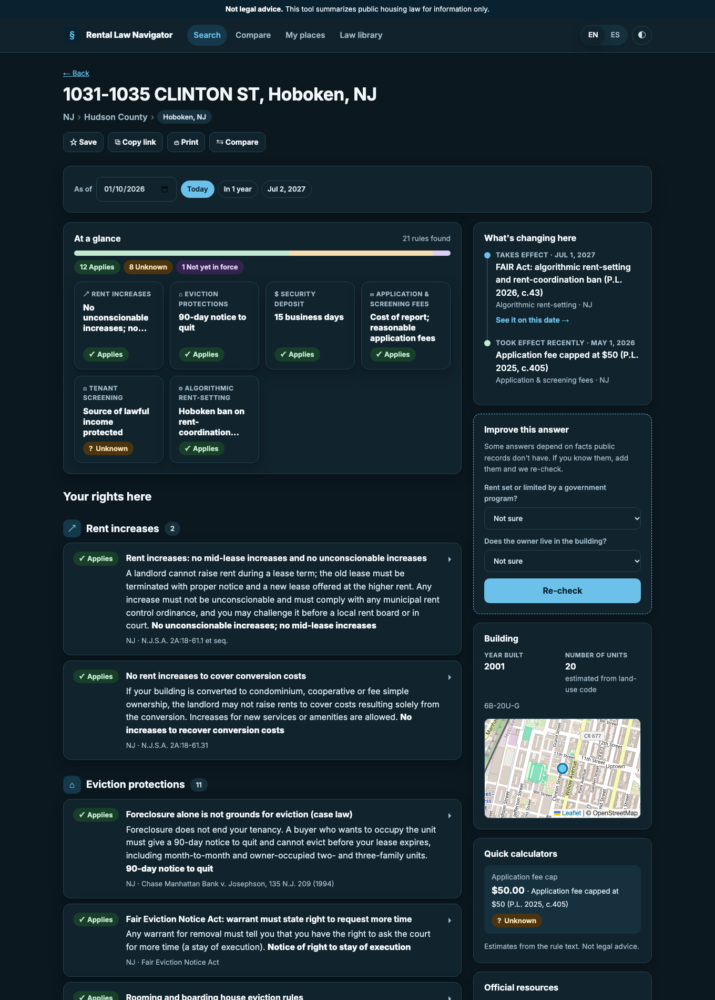
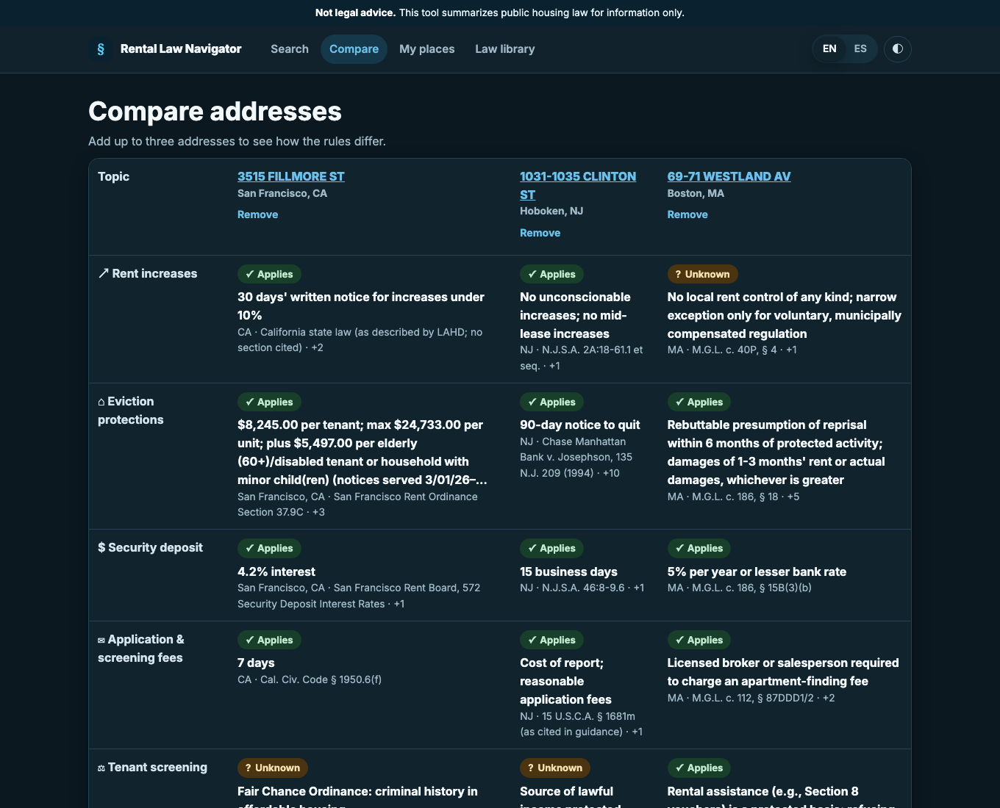
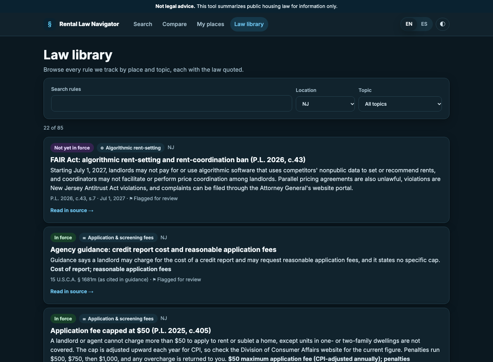
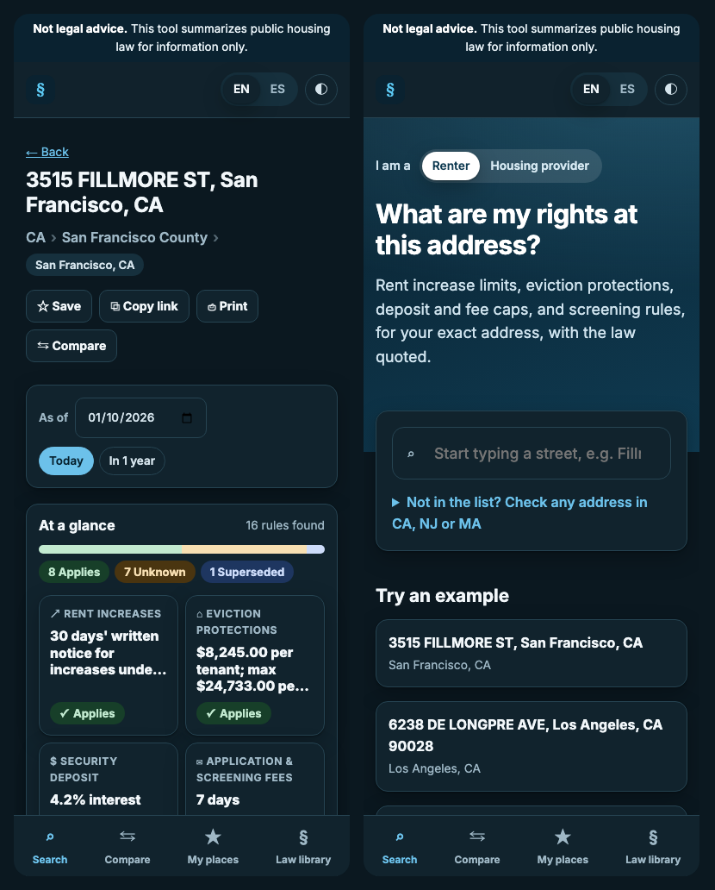

# Rental Law Navigator

**Which rental housing rules apply at this address today, and what is about to change?**

Rental Law Navigator answers that question for a single apartment address in California, New Jersey or
Massachusetts. It reads public state and city law, turns it into structured rules, and shows every answer with
the exact sentence of law it comes from. Where the public records lack a fact needed to decide, the answer is
**Unknown**, never a guess.

> **Not legal advice.** This tool summarizes public housing law for information only. Check with a qualified
> attorney, your local rent board, or a tenant or landlord organization before acting.

Built for the Hack-Nation 7th Global AI Hackathon, RealPage challenge "Rental Housing Law Navigator".



---

## Contents

- [Who it is for](#who-it-is-for)
- [Features](#features)
- [Design](#design)
- [How it works](#how-it-works)
- [Run it locally](#run-it-locally)
- [Switching the AI model](#switching-the-ai-model)
- [Deploy](#deploy)
- [Project structure](#project-structure)
- [Testing](#testing)
- [Responsible AI](#responsible-ai)
- [Known limits](#known-limits)

---

## Who it is for

| Audience | What they get |
|---|---|
| **Renters** | Their rights at their own address: rent increase limits, eviction protections, deposit and fee caps, screening rules. |
| **Housing providers**, especially small owners without legal teams | Their obligations at a specific building before they set rents, deposits, fees or notices. |
| **Advocates and agencies** | Which protections cover which buildings, what a new or pending law would change, and a searchable library of every rule. |

A **Renter / Housing provider** switch on the home page changes the framing ("Your rights here" vs "Your
obligations here"); the underlying answer is the same.

---

## Features

### 1. Search any address



* Autocomplete over the 500 sample multifamily addresses, showing the **legal city** for each (a mailing name
  like "Dorchester" is inside Boston).
* **Check any other address** in CA, NJ or MA: it is geocoded live with the US Census Geocoder. Building facts
  then come only from what you enter.
* Saved places, recent searches and example addresses on the home page.

### 2. The address report



| Module | What it shows |
|---|---|
| **Jurisdiction trail** | State › County › legal city, so you know which governments' rules are in play. |
| **At a glance** | One tile per topic with the headline number or rule and its status, plus a bar of how many rules apply, depend on missing facts, are superseded, not yet in force, or proposed. Tiles jump to the topic. |
| **Six topics** | Rent increases, eviction protections, security deposit, application & screening fees, tenant screening, algorithmic rent-setting. Each rule card shows a status chip, a plain-language summary, the key number, the citation and the effective date. |
| **Why this result** | Expanding a rule shows the reason (e.g. "Covered, but the San Francisco Rent Ordinance governs here instead"), any missing facts, conflict flags for human review, and the **quoted law**. |
| **Read in source** | Opens a drawer with the original document and the quoted passage highlighted, with the retrieval date and a link to the official page. |
| **What's changing here** | A timeline of laws taking effect later (e.g. the NJ FAIR Act on Jul 1, 2027), laws that took effect recently, and proposed bills. "See it on this date" re-runs the whole answer for that day. |
| **As-of date** | Any date, with quick picks for today, one year out and each upcoming effective date. |
| **Improve this answer** | When answers are Unknown because public records lack a fact, add it (year built, number of units, whether rent is set by a government program, whether the owner lives in the building) and the same checks re-run. |
| **Building and map** | Year built, units (exact or estimated from the land-use code, and labelled as such), use, and a location map. |
| **Quick calculators** | Largest rent increase, largest deposit and application-fee cap, only from rules that state a clear number. Formulas such as "5% + CPI, max 10%" are shown only as a ceiling. |
| **Official resources** | Links to the official city and state pages in our source library. Links are never invented. |
| **Save, Copy link, Print, Compare** | Links reproduce the exact answer (date and confirmed facts included); print gives a clean report with every rule expanded. |

### 3. Compare addresses



Up to three addresses side by side, one row per topic, showing the governing rule, its status, key number and
citation in each place.

### 4. Law library



Browse and search every rule by place and topic, with status (in force, not yet in force, proposed, failed), the
citation, the effective date, review flags and the quoted source.

### 5. Everywhere



* **English / Español** interface (legal summaries and quotes stay in English, and the page says so).
* **Light, dark or system** theme.
* **Mobile** layout with bottom navigation.
* **Accessible**: status is always written in words with an icon (never colour alone), keyboard navigation for
  search and the source drawer, skip link, labelled landmarks, screen-reader announcements.
* **"Not legal advice"** on every page, in the footer, and as an `X-Not-Legal-Advice: true` header on every API
  response.

---

## Design

**Principles**

1. **Show the law, not a verdict.** Every rule carries its citation and a quote that code has checked against the
   source. The product explains; it never tells anyone how to work around a rule.
2. **Unknown beats a confident guess.** If coverage depends on a fact the records don't have, the answer says
   Unknown and names the fact, and offers a way to supply it.
3. **One address, one date.** Answers depend on exactly where and when. The date is always visible and can be
   changed; upcoming changes are a first-class part of the report.
4. **Calm and civic.** A quiet palette, generous spacing, plain words, status chips in the style of the US Web
   Design System (word plus icon), and a single source drawer instead of navigating away.

**Inspired by** claim-level citation patterns in legal AI tools (answer on one side, highlighted source on the
other), Perplexity-style inline sourcing, JustFix's address-first tenant tools, the RentRights address lookup
(dated figures, "confirm instead of guess"), and landlord-compliance products that layer state defaults with local
overrides and alert on upcoming changes.

**Status vocabulary**

| Chip | Meaning |
|---|---|
| ✓ **Applies** | In force and covers this address. |
| ? **Unknown** | Coverage depends on a fact the data does not include (named in the card). |
| ⇄ **Superseded** | Covered, but a rule at another level governs here (e.g. state cap yields to local rent control). |
| ◷ **Not yet in force** | Enacted, but its effective date is after the selected date. |
| ✎ **Proposed** | A bill or measure, not law. Never shown as applying. |

---

## How it works

Language models only **read** the law; plain code makes every **decision**.

```
 BUILD (agents, offline)
 public law ─▶ Extractor ─▶ Verifier ─▶ Consolidator ─▶ Coverage check ─▶ Auditor ─▶ KNOWLEDGE BASE
 documents     (LLM)        (code)      (LLM)           (LLM, verified)    (LLM)      (SQL, versioned)
                                                                                            │
 ANSWER (plain code, no model)                                                              ▼
 address ─▶ Census Geocoder ─▶ legal city ─▶ Evaluator: dates → building facts → precedence → conflicts
                                                        │
                                                        ▼
            applies · unknown · superseded · not yet in force · proposed
            + explanation + citation + quoted law  ─▶  FastAPI  ─▶  React UI
```

**Build pipeline**

| Step | Type | Guardrail |
|---|---|---|
| **Ingest** | code | Each document keeps its URL and retrieval date; long documents are split on section boundaries. |
| **Extractor** | LLM | Structured output; the jurisdiction must be one the document covers; every quote copied verbatim; relative effective dates ("the first day of the twelfth month after enactment") computed from the stated approval date and explained. |
| **Verifier** | code | Every quote must be found in the source (tolerant of whitespace and quote style). One repair round may only pick among real passages. Otherwise the rule is dropped. The stored quote is always the source's own text. |
| **Consolidator** | LLM | Groups candidates into one rule per law and topic, links "supersedes", "narrow exception" and "may conflict", and records "no rule at this level" findings. Code rebuilds every field from verified data, so it cannot change a number, date or quote. |
| **Coverage check** | LLM | Re-reads related documents to fill building conditions (cutoff dates, unit thresholds, exemptions). Used only if its quote verifies. |
| **Auditor** | LLM | Independent second read; any field it finds contradicted raises a review flag and lowers confidence. |
| **Knowledge base** | SQL | Sources, rules (versioned), no-rule findings, addresses, model-call cache and audit log. Any run can be replayed offline. |

**Answer path (no model at query time)**

1. **Resolve**: the Census Geocoder places the address in its legal city and county (with a house-number check
   and a flagged postal-city fallback).
2. **Facts**: year built and units from assessor records; unit ranges derived from land-use codes are labelled
   as estimates.
3. **Evaluate**, three-valued (true / false / unknown): **time** (pending, failed, not yet effective, sunset),
   **coverage** (unit thresholds, building-age cutoffs, exemptions; a certificate-of-occupancy cutoff in the
   building's own year is Unknown), **precedence** (a local rule that applies supersedes the state rule it
   overrides), **conflicts** (possible preemption is flagged for review).
4. **Explain**: templated explanations, never generated text.

---

## Run it locally

Requirements: Python 3.12+ with [uv](https://docs.astral.sh/uv/), Node 20+.

```bash
make setup                                        # Python dependencies
make frontend                                     # build the React UI into web/dist
DATABASE_URL=sqlite:///data/release.db make serve # http://127.0.0.1:8765, using the shipped knowledge base
```

To rebuild the knowledge base from the law corpus, place the challenge starter pack in `starter_pack/` (it is not
redistributed here), link it as `starter`, add an API key to `.env`, then:

```bash
ln -s "starter_pack/participant-final-no-hour16 3" starter
cp .env.example .env            # add ANTHROPIC_API_KEY (or another provider's key)
make build-kb                   # ingest -> extract -> consolidate (LLM calls, cached in the database)
make outputs                    # geocode, export output/*.json, self-check report
python scripts/make_release_db.py
```

**Command line**

```bash
python -m navigator lookup A0016 --as-of 2027-07-02      # one address, any date
python -m navigator ingest-new law.txt --jurisdiction "Cambridge, MA" --url https://...   # add a new law
python -m navigator selfcheck                             # quality report
```

`ingest-new` runs the same agents on a newly released law, writes a new knowledge-base version, and lists which
addresses it affects, today and on its effective date.

---

## Switching the AI model

One provider-neutral layer (`navigator/llm`) sits behind every model call. Set it in `.env`:

| `LLM_PROVIDER` | Default model | Key |
|---|---|---|
| `anthropic` | `claude-opus-5-5` | `ANTHROPIC_API_KEY` |
| `openai` | `gpt-5` | `OPENAI_API_KEY` |
| `gemini` | `gemini-flash-latest` | `GEMINI_API_KEY` |
| `groq` | `openai/gpt-oss-120b` | `GROQ_API_KEY` |
| `ollama` | `llama3.3` (local) | none (`OLLAMA_BASE_URL`) |

`LLM_MODEL` overrides the default. Each adapter uses the vendor's own structured-output mode, and responses are
validated with the same Pydantic models. Calls are cached in the database by a hash of provider, model, prompt
and input. The deployed app needs **no** key: answers are computed without a model.

---

## Deploy

[](https://render.com/deploy?repo=https://github.com/AkashDeepSinghJassal/rental-law-navigator)

The `Dockerfile` builds the React UI, installs the Python app and serves both with the knowledge base. It reads
the port from `$PORT` (default 8080).

* **Render**: the button above uses `render.yaml` (free plan).
* **Fly.io**: `fly launch --copy-config --no-deploy && fly deploy` (`fly.toml`, scales to zero).
* **Any Docker host**: `docker build -t rental-law-navigator . && docker run -p 8080:8080 rental-law-navigator`.

---

## Project structure

```
navigator/            Python package
  llm/                provider-neutral model layer (Anthropic, OpenAI, Gemini, Groq, Ollama) + cache/audit
  corpus.py           ingest and chunking
  extract.py          extractor agent + verification with one repair round
  verify.py           quote verification (normalized exact match, snap, candidate passages)
  consolidate.py      consolidator, coverage check, auditor, knowledge-base versions
  geo.py, facts.py    Census geocoding, building facts
  evaluate.py         deterministic three-valued evaluator
  changes.py          change tracking and ingest-new
  export.py           schema-validated JSON outputs
  db.py               SQLAlchemy models (SQLite by default, any SQL database via DATABASE_URL)
web/app.py            FastAPI: API + serves the built UI
frontend/src/         React + TypeScript (Vite)
  lib/                api client, types, routing, i18n, preferences, saved places, domain logic
  components/         layout, search, rule card, source drawer, timeline, at-a-glance, calculators, map, ...
  pages/              Home, Report, Compare, My places, Law library
data/release.db       the knowledge base served by the app
output/               rules.json, lookups.json, changes.json, selfcheck.txt
tests/                Python tests (real database, real LLM APIs, real Census Geocoder)
docs/                 screenshots and audio scripts
```

---

## Testing

```bash
make test                                   # Python: 38 tests
cd frontend && npx vitest run               # front end: calculator parsers, timeline
```

Tests use real services, with no mocks: a real SQLite database, live calls to each configured LLM provider
(structured output and caching), live extraction on real statutes, the real Census Geocoder for all 500
addresses, and the FastAPI app over its real knowledge base. Model and geocoder responses are cached in the test
database, so reruns are fast and replayable (`NAVIGATOR_OFFLINE=1` fails on any cache miss).

---

## Responsible AI

| The product does | The product does not |
|---|---|
| Cite the source and retrieval date for every rule | Present output as legal advice or a compliance certification |
| Show an as-of date on every answer; separate enacted, pending and failed law | Suggest ways to avoid or work around a rule |
| Say Unknown when coverage depends on facts it doesn't have | Invent rules, citations or links |
| Flag conflicts and low-confidence answers for human review | Use customer, resident, pricing or other non-public data |
| Keep an audit log of every model call and pipeline decision | Call a model when answering a user's question |

---

## Known limits

* Rules come from the supplied public corpus. Some key texts were only available as links (several New Jersey
  statutes; Hoboken and Newark ordinances). Rules from secondary pages are marked lower-confidence.
* Public records lack owner type, certificate-of-occupancy dates and, for some cities, year built or unit counts,
  so many answers are honestly Unknown until the person supplies the fact.
* Spanish covers the interface; legal text is in English.
* Saved places are stored in the browser only.
* The current knowledge base was built with the auditor step skipped in its final run; rebuilding with
  `python -m navigator consolidate` restores it.

*Not legal advice. Summaries of law are for information and prototyping only and have not been reviewed by
counsel.*
